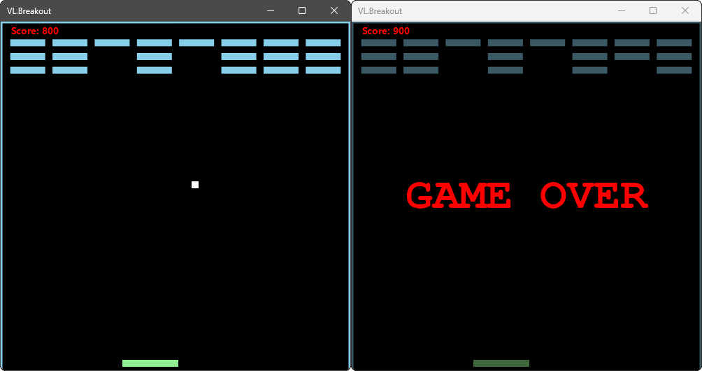

# VL.Breakout

A simple implementation of the classic game Breakout in VL.

## Game Instructions

You can use the left and right arrow keys to move the paddle in the desired direction.

You can reset the game by pressing the 'R' key.

Inside vvvv you can also specify the board's width and height, as well as the ball size.

## Credits

Based on [this](https://www.youtube.com/watch?v=EmhkLLWAZ8E) video tutorial by [Kenny Yip](https://www.youtube.com/@KennyYipCoding).

---

Made with [vvvv](https://visualprogramming.net/).

